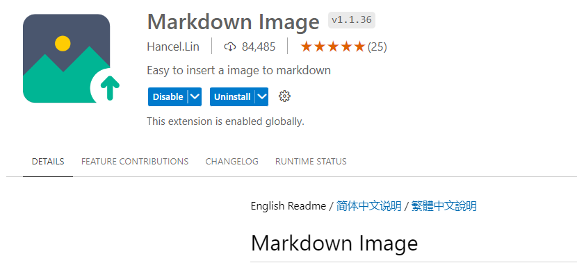
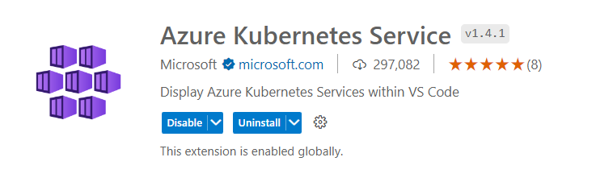
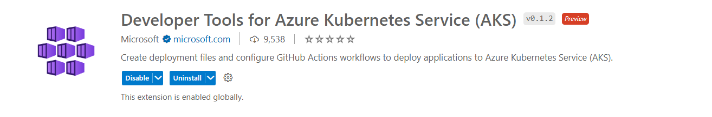

# Useful vscode Extensions

## Generally

### Mardown Image

Copy image files or paste screenshots, Shortcut key Alt + Shift + V, or right-click menu Paste Image.

## AKS (Azure Kubernetes Service)

### AKS Extension

Reference and Documentation : https://azure.github.io/vscode-aks-tools/index.html

### AKS Dev Extensions

https://marketplace.visualstudio.com/items?itemName=ms-kubernetes-tools.aks-devx-tools

Based on tool Azure draft and is written in go: https://github.com/Azure/draft 

 